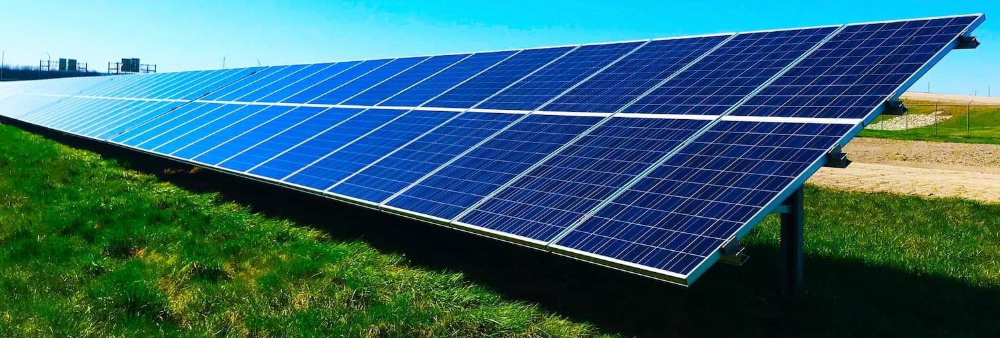

# keydi35LabMDS
Respositorio para el curso MDS7202

    

 

<h1 align="center">Hola, mi nombre es Samuel Clavel </h1>

Soy estudiante de último año de Ingeniería Civil Eléctrica en la Universidad de Chile. 

 

## Datos sobre mi!!

 

- Mis interéses en el ámbito académico se realacionan principalmente con las energías renovables no convensionales (ERNC). Actualmente me encuentro trabajando en la empresa ⚡Nikola como ingeniero de proyectos, diseñando y llevando a cabo proyectos fotovoltáicos residenciales. 
- Por otro lado, me gusta mucho la docencia por lo que he sido parte de al rededor de 13 cuerpos docentes en 2 universidades en cargos de ayudante corrector y profesor auxiliar. 
- Mis hobbies son los deportes: handball, basquetbol y futbol principalmente pero también disfruto de nadar o subir cerros.
- También me gusta ver todo tipo de series, películas, el animé y mangas y disfruto mucho los videojuegos y los juegos de mesa
 
